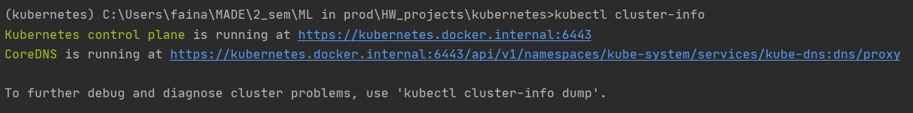
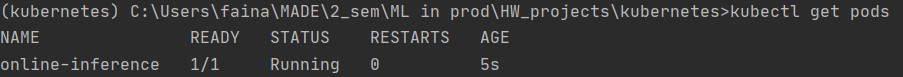
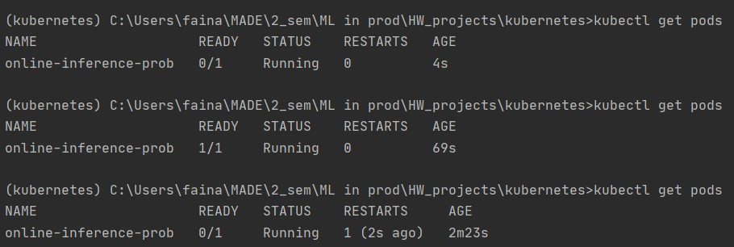
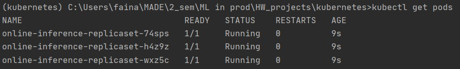

# HW 4 Kubernetes

Установка Kubernetes была произведена через Docker desktop

Check if cluster works
~~~
kubectl cluster-info
~~~
Enable port forwarding
~~~
kubectl port-forward pod/online-inference-pod 8000:8000
~~~
Run pods:
~~~
kubectl apply -f kubernetes/online-inference-pod.yaml
kubectl apply -f kubernetes/online-inference-pod-resources.yaml
kubectl apply -f kubernetes/online-inference-pod-probes.yaml
kubectl apply -f kubernetes/online-inference-replicaset.yaml
kubectl apply -f kubernetes/online-inference-deployment-blue-green.yaml
kubectl apply -f kubernetes/online-inference-deployment-rolling-update.yaml
~~~
Check pods:
~~~
kubectl get pods
~~~

Самооценка:
0. Установите kubectl
1. Разверните Kubernetes (5 баллов)

2. Напишите простой Pod manifest для вашего приложения, назовите его online-inference-pod.yaml (4 балла)

3. Пропишите Requests / Limits и напишите, зачем это нужно в описании PR. Закоммитьте файл online-inference-pod-resources.yaml (2 балла)
4. Модифицируйте свое приложение так, чтобы оно стартовало не сразу (с задержкой 20-30 секунд) и падало спустя минуты работы. Добавьте Liveness и Readiness пробы и посмотрите, что будет происходить. Напишите в описании -- чего вы этим добились. Закоммитьте отдельный манифест online-inference-pod-probes.yaml (и изменение кода приложения). Опубликуйте ваше приложение (из ДЗ #2) с тэгом v2 (3 балла)

5. Создайте ReplicaSet, сделайте 3 реплики вашего приложения. Закоммитьте online-inference-replicaset.yaml (3 балла)

Ответьте на вопрос, что будет, если сменить docker образ в манифесте и одновременно с этим:

a) Если уменьшить число реплик, то останется отмеченное кол-во реплик со старым docker оборазом.

б) Если увеличить число реплик, то добавятся новые реплики до необходимого кол-ва с новым docker оборазом. Старые реплики останутся с прежним docker оборазом.

Поды с какими версиями образа будут внутри кластера?

Опишите Deployment для вашего приложения (3 балла) Играя с параметрами деплоя (maxSurge, maxUnavaliable), добейтесь ситуации, когда при деплое новой версии:

a) есть момент времени, когда на кластере существуют как все старые поды, так и все новые (опишите эту ситуацию) (закоммитьте файл online-inference-deployment-blue-green.yaml)

б) одновременно с поднятием новых версий, гасятся старые (закоммитьте файл online-inference-deployment-rolling-update.yaml)

Итого: 20 баллов